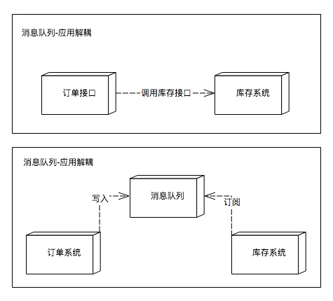
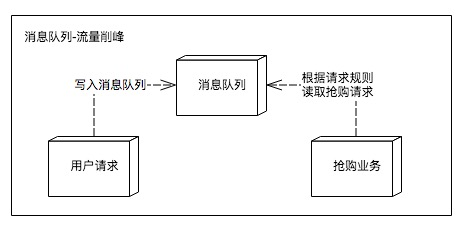
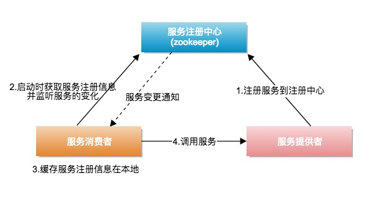
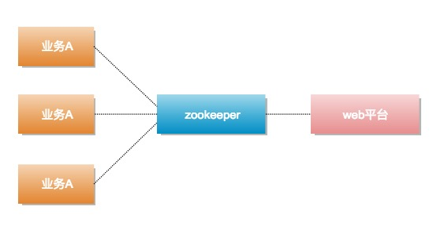
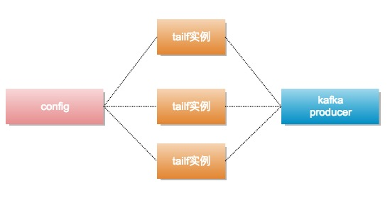
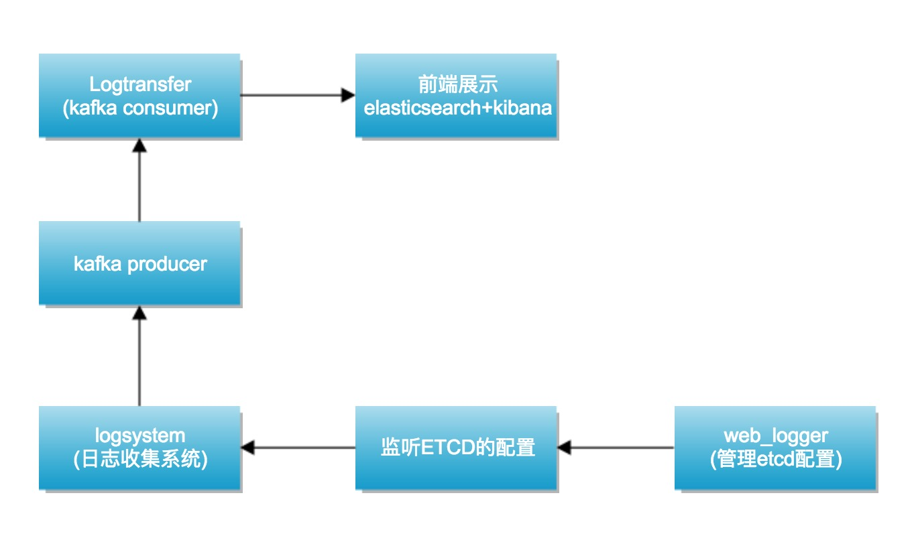

# 日志收集系统

1.项目背景

* 每个系统都有日志,当系统出现问题时,需要通过日志解决问题
* 当系统机器比较少时,登录到服务器上查看即可满足
* 当系统机器规模巨大,登录到机器上查看几乎不显示
* 数据挖掘分析

2.解决方案

* 把机器上的日志实时收集,统一存储到中心系统
* 然后再对这些日志建立索引,通过搜索找到对应日志
* 通过提供友好的web页面,通过web即可完成日志搜索

3.面临的问题

* 实时日志量非常大, 每天几十亿条
* 日志准时收集, 延迟控制在分钟级别
* 能够水平扩展


4.ELK方案缺点

* 运维成本高,每增加一个日志搜集,都需要手动需要修改配置
* 监控缺失,无法准确获取logstash的状态
* 无法做定制化开发及维护

5.日志搜集系统设计

* 布在每一台业务机器上去, 客户端根据配置去读要搜集的每一个日志

<div align=center></div>

* 组件介绍
	* LogAgent: 日志搜集客户端,用来收集服务器上的日志
	* Kafka: 高吞吐量分布式队列,linkin开发,apache顶级开源项目
	* elasticsearch: 开源的搜索引擎,提供基于http restfuld的web接口
	* hadoop: 分布式计算框架,能够对大量数据进行分布式处理的平台
	* strom: 实时计算框架

6.kafka应用场景

* 1).异步处理,把非关键流程异步化,提高系统的响应时间和健壮性


* 2).通过消息队列应用解耦



* 3).流量削峰



7.zookeeper应用场景

* 1).服务注册&服务发现



* 2).作为"配置中心"使用
	* web平台管理所有业务配置写入到zookeeper,业务应用A、B、C与zookeeper保持长连接,如果配置有变动,zookeeper节点会通知到业务应用


* 3).分布式锁
	* zookeeper是强一致的
	* 多个客户端同时在zookeeper上创建相同的node,只有一个创建成功


8.etcd介绍与使用

* 概念:高可用的分布式key-value存储,可以用于配置共享和服务发现
* 类似项目:zookeeper和consul
* 开发语言:Go
* 接口:提供restful的http接口,使用简单
* 实现算法:基于raft算法的强一致性,高可用的服务存储目录

9.etcd应用场景

* 服务发现与服务注册
* 配置中心
* 分布式锁
* master选举

10.LogSystem初始设计

* config:配置模块(日志路径,文件名).程序运行后,需要读取哪些日志,从config中获取
* tailf:需要读取的日志,使用tailf的实例不断的拿到日志之后,放到channel里面 
* kafka:kafka的goroutine从channel里面拿数据,写到kafca里面



11.LogSystem最终设计

* 1.webLogger管理所有日志的配置,把配置写到etcd里面, 
* 2.LogSystem监听etcd的变化获取最新的配置,并且生效.
* 3.按照etcd配置收集相关日志后,发到kafka里面
* 4.logtransfer消费kafka里的数据,把数据写到es里面,通过kibana做数据的展示



12.使用说明

* 所需工具:
	* mysql
	* kafka
	* zookeeper
	* etcd
	* elasticsearch
	* kibana


* 依赖的库

	```
	go get github.com/coreos/etcd/clientv3
	go get github.com/Shopify/sarama
	go get gopkg.in/olivere/elastic.v5
	go get github.com/coreos/etcd/mvcc/mvccpb
	go get github.com/hpcloud/tail
	go get github.com/jmoiron/sqlx
	go get github.com/astaxie/beego
	// go get github.com/astaxie/beego/logs
	// go get github.com/astaxie/beego/config
	```

* 启用服务
	* zookeeper&kafka: **zookeeper-server-start /usr/local/etc/kafka/zookeeper.properties & kafka-server-start /usr/local/etc/kafka/server.properties** 
	* etcd: **可直接执行对应文件夹etcd**
	* elasticsearch: **docker run -d -p 9200:9200 elasticsearch**
	* kibana: **docker run --name mykibana -e ELASTICSEARCH_URL=http://172.17.0.1:9200 -p 5601:5601 -d kibana**(kibana容器的运行需要指定elasticsearch的ur, http://172.17.0.1:9200)

* 运行说明
	* Logsystem/main/ logsystem客户端收集
	* Logsystem/logtransfer 数据转发
	* web_logger etcd配置管理平台(127.0.0.1:9090)